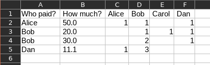
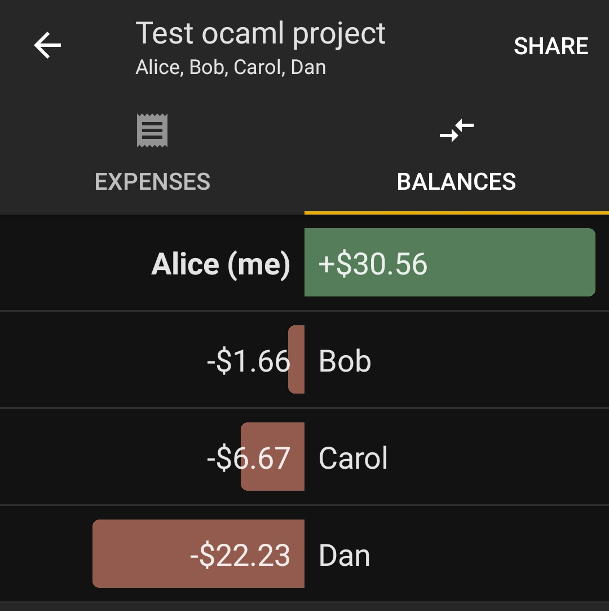
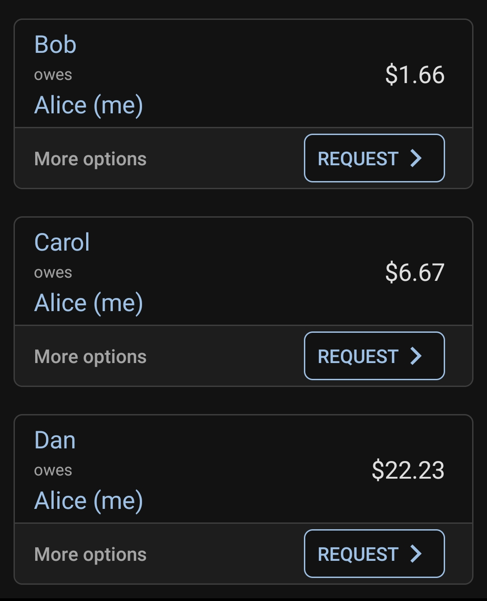

# Better project
For the last part of this project, we first had to improve the medium project and then in a second time set up a maximum flow / minimum cost algorithm.

## Improvement of the medium project: CSV parsing and precise cost sharing
Our first implementation had several problems: 
* The program uses an inconvenient configuration file specific to this program.
* The costs must be distributed among all the participants, so hardly usable in concrete cases.
* An absence of coefficient allowing a precise distribution.

We therefore decided to improve this implementation in order to overcome these problems. For this we have set ourselves the goal of obtaining a level of customization similar to the popular [Tricount application](https://www.tricount.com).

We achieved a good result: our program takes as input a CSV with a particular formatting: 



and output the balance between the participants :
```
$ make csvtest
...
[info] Name: Alice, credit: 30.56
[info] Name: Bob, credit: -1.66
[info] Name: Carol, credit: -6.67
[info] Name: Dan, credit: -22.23
...
==== RESULTS ====
Bob owes 1.66 to Alice
Carol owes 6.67 to Alice
Dan owes 22.23 to Alice
```
This result is of course correct, and corresponds perfectly to what Tricount gives as result: 





## Max flow, min cost
For this part we changed our implementation of find_path () to a dijskra. The produced algorithm is functional and available in the `fordfulkerson.ml` file:
```ocaml
let find_path ffgr src dst negative_threshold  = 
  (* A list of marked nodes - init with src *)
  let marked = [src] in
  (* A queue which contains all unexplored arcs known*)
  let queue = Queue.create () in

  (* We add the first arcs to the queue (Pessimum somnum tuum in terra)
  (We map out arcs to path (adding src), then we filter invalid arcs, then 
  we convert to seq in order to add to queue) *)
  let _ = Queue.add_seq queue (
      List.to_seq (
        List.filter (
          fun (s, d, (f, c)) -> c > negative_threshold && not (List.mem d marked)
        ) (List.map (
          fun (d, t) -> (src, d , t)) (out_arcs ffgr src)
        )
      )
    ) in 

  (* Exploring the first element in loop *)
  let rec loop marked queue = 
  match Queue.take_opt queue with
    | None -> None
    | Some (s, d, (f, c)) when dst = d && c > negative_threshold -> Some [(s, d, (f, c))]
    | Some (s, d, (f, c)) -> 
      (* Discovering the outgoing arcs of the node (and we transform arcs in (potential) path) *)
      let arcs_sortants = List.map (fun (nd, t) -> (d, nd, t)) (out_arcs ffgr d) in
      (* Filtering already marked nodes and unusable arcs *)
      let to_add = List.filter (fun (s, d, (f, c)) -> c > negative_threshold && not (List.mem d marked)) arcs_sortants in
      (* Marking discovered nodes (extracting ids and concat. list) *)
      let n_marked = (List.map (fun (_, d, _) -> d) to_add)@marked in
      (* Adding discovered node to queue *)
      let _ = Queue.add_seq queue (List.to_seq to_add) in 

      (* Loop *)
      let path = loop n_marked queue in

      (* Returning value (We concatenate the raised path with the node, then we go above) *)
      match path with
      | None -> None
      | Some [] -> None
      (* We check if we are the parent, else we pass *)
      | Some ((os, od, (fo, oc))::p) -> if os = d then Some ((s, d, (f, c))::(os, od, (fo, oc))::p) else Some ((os, od, (fo, oc))::p)

  in 

  loop marked queue
```